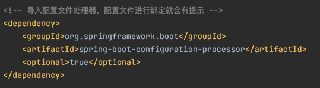
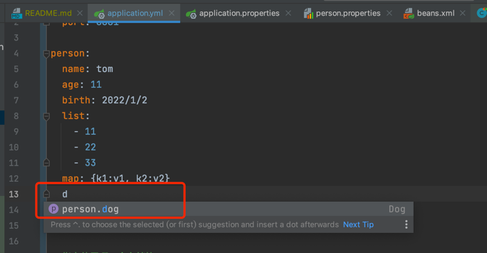
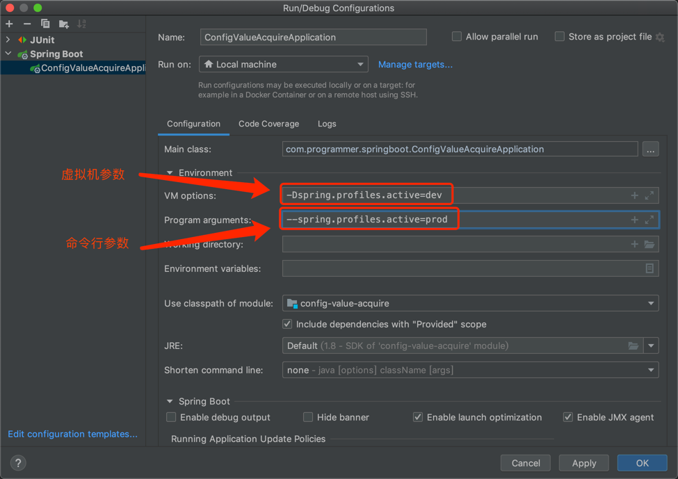

# 读取配置文件中的值赋值给类属性
SpringBoot使用一个全局的配置文件，配置文件名是固定的; 
* application.properties
* application.yml

1、读取yml配置文件的值

2、读取properties配置文件的值

3、@Value()获取配置文件中的值赋值给类中的属性

4、@ConfigurationProperties支持JSR303校验，@Value()不支持

5、加载指定的配置文件 @PropertySource(value = {"classpath:person.properties"})

6、导入Spring的配置文件让其生效 @ImportResource(locations={"classpath:beans.xml"}) 

7、导入Spring的配置文件让其生效 @Configuration+@bean 

8、配置文件占位符 ${}  #{}

小技巧：

-------------------------
# 多profile文件
我们在主配置文件编写的时候，文件名可以是 application-{profile}.properties/yml 

默认使用application.properties的配置;

## 激活指定profile
1、在配置文件中指定 spring.profiles.active=dev

2、命令行:
java -jar spring-boot-02-config-0.0.1-SNAPSHOT.jar --spring.profiles.active=dev; 可以直接在测试的时候，配置传入命令行参数

3、虚拟机参数;
-Dspring.profiles.active=dev

