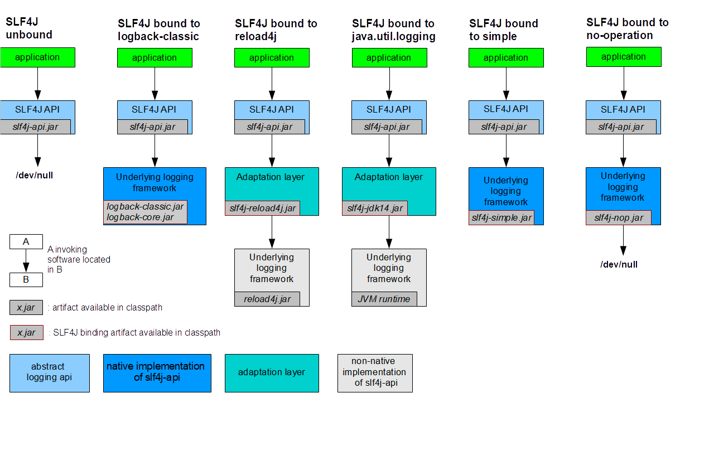
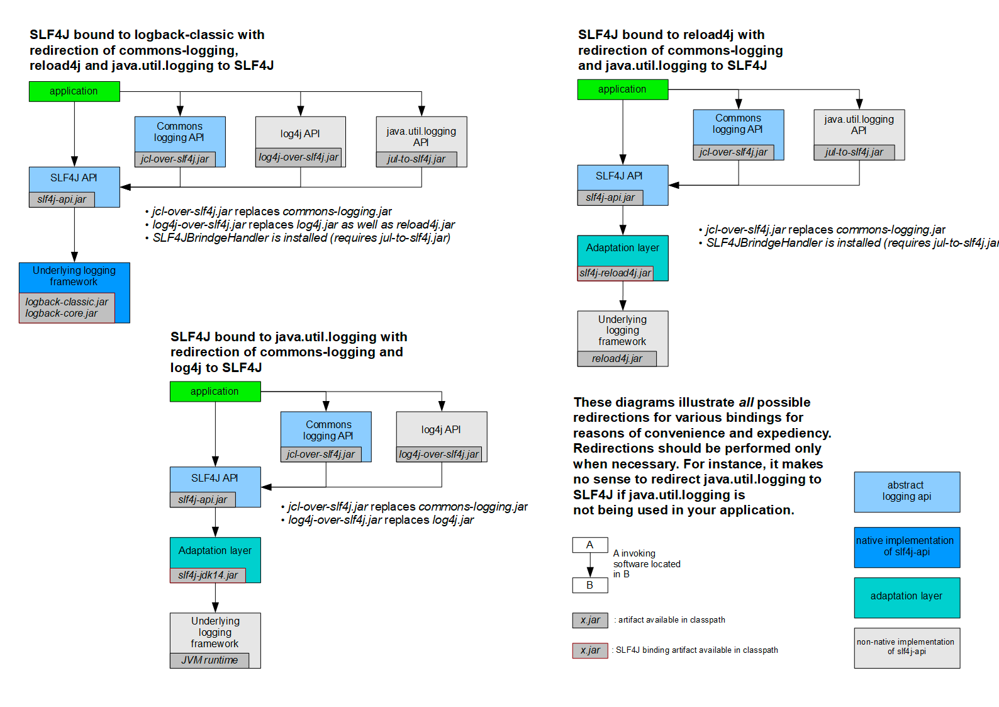

# 日志框架
| 日志门面（日志的抽象层） | 日志实现 |
|---|---|
| JCL(Jakarta Commons Logging) 、SLF4j(Simple Logging Facade for Java) 、jboss-logging | Log4j 、JUL(java.util.logging) 、Log4j2 、Logback |

左边选一个门面(抽象层)、右边来选一个实现; 

日志门面: SLF4J;

日志实现:Logback;

Spring框架默认是用JCL;

**SpringBoot选用 SLF4j和logback;**

# SLF4j使用
## 1、如何在系统中使用SLF4j https://www.slf4j.org
开发的时候，日志记录方法的调用，不应该来直接调用日志的实现类，而是调用日志抽象层里面的方法; 

给系统里面导入slf4j的jar和 logback的实现jar

使用方式
```java
import org.slf4j.Logger;
import org.slf4j.LoggerFactory;

/**
 * @Author programmerGoGo
 * @Description
 */
public class Hello {

    private static Logger logger = LoggerFactory.getLogger(Hello.class);

    public static void main(String[] args) {
        logger.info("hello.");
    }
}
```

图示：

每一个日志的实现框架都有自己的配置文件。使用slf4j以后，**配置文件还是做成日志实现框架自己本身的配置文件**;

## 2、历史遗留问题
如何统一日志记录，使别的框架和我一起统一使用slf4j进行输出?

Spring(commons-logging)、Hibernate(jboss-logging)、MyBatis、xxxx



如何让系统中所有的日志都统一到slf4j; 

1、将系统中其他日志框架先排除出去（此时系统可能无法启动，因为可能缺少依赖的日志类）; 

2、用中间包来替换原有的日志框架（中间包包括了原有依赖包中所需要的日志类，并且使用了相同的类全路径）;

3、我们导入slf4j其他的实现（对外使用的是slf4j的日志接口，但是底层实现仍然使用原有的日志实现）


# springboot默认日志配置

[spring-log官方文档配置](https://docs.spring.io/spring-boot/docs/current/reference/html/features.html#features.logging)

```java
public class UserService {
    //记录器
    Logger logger = LoggerFactory.getLogger(UserService.class);

    public UserService() {

        // 日志的级别由低到高 trace<debug<info<warn<error
        // 可以调整输出的日志级别;日志就只会在这个级别以以后的高级别生效
        logger.trace("这是UserService-trace日志...");
        logger.debug("这是UserService-debug日志...");

        //SpringBoot默认给我们使用的是info级别的，没有指定级别的就用SpringBoot默认规定的级别
        logger.info("这是UserService-info日志...");
        logger.warn("这是UserService-warn日志...");
        logger.error("这是UserService-error日志...");
    }
}
```

## 1、通过设置 application.properties 修改日志相关参数。
```properties
# 这里是用的root级别，即项目的所有日志，我们也可以使用package级别，即指定包下使用相应的日志级别。
#logging.level.root=error
# 只有 com.programmer.springboot.logging.model 包下
logging.level.com.programmer.springboot.logging.model=trace

# 不指定路径，则在当前项目下生成springboot.log日志
# 可以指定完整的路径;
logging.file=springboot.log
# 在路径下创建spring文件夹和里面的log文件夹;使用 spring.log 作为默认文件（注意：这里我用的是mac，如果没有当前目录的操作权限，则创建会失败）。logging.file 配置优先级大于 logging.path
#logging.path=/Users/{当前用户目录}/spring/log


# 在控制台输出的日志的格式
logging.pattern.console=%d{yyyy‐MM‐dd}[%thread]%‐5level%logger{50}‐%msg%n
# 指定文件中日志输出的格式
logging.pattern.file=%d{yyyy‐MM‐dd}===[%thread]===%‐5level===%logger{50}====%msg%n
```
## 2、通过添加日志配置文件修改日志相关参数。


[官方文档配置参考](https://docs.spring.io/spring-boot/docs/current/reference/html/features.html#features.logging.logback-extensions.profile-specific)
```xml
<springProfile name="staging">
    <!-- configuration to be enabled when the "staging" profile is active -->
    可以指定某段配置只在某个环境下生效
</springProfile>

<springProfile name="dev | staging">
<!-- configuration to be enabled when the "dev" or "staging" profiles are active -->
</springProfile>

<springProfile name="!production">
<!-- configuration to be enabled when the "production" profile is not active -->
</springProfile>
```
如：
```xml
<appender name="stdout" class="ch.qos.logback.core.ConsoleAppender">
    <!‐‐
    日志输出格式: %d表示日期时间，
    %thread表示线程名，
    %‐5level:级别从左显示5个字符宽度
    %logger{50} 表示logger名字最长50个字符，否则按照句点分割。 %msg:日志消息，
    %n是换行符
    ‐‐>
    <layout class="ch.qos.logback.classic.PatternLayout">
        <springProfile name="dev">
            <pattern>%d{yyyy‐MM‐dd HH:mm:ss.SSS} ‐‐‐‐> [%thread] ‐‐‐> %‐5level
            %logger{50} ‐ %msg%n</pattern>
        </springProfile>
        <springProfile name="!dev">
            <pattern>%d{yyyy‐MM‐dd HH:mm:ss.SSS} ==== [%thread] ==== %‐5level
            %logger{50} ‐ %msg%n</pattern>
        </springProfile>
    </layout>
</appender>
```
如果使用logback.xml作为日志配置文件，还要使用profile功能，会有以下错误 

`no applicable action for [springProfile]`

