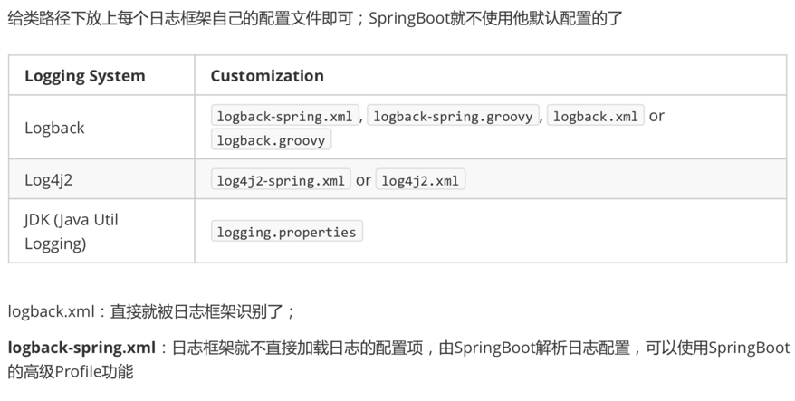

# springboot默认日志配置


[spring-log官方文档配置](https://docs.spring.io/spring-boot/docs/current/reference/html/features.html#features.logging)

1、通过设置 application.properties 修改日志相关参数。

2、通过添加日志配置文件修改日志相关参数。


[官方文档配置参考](https://docs.spring.io/spring-boot/docs/current/reference/html/features.html#features.logging.logback-extensions.profile-specific)
```xml
<springProfile name="staging">
    <!-- configuration to be enabled when the "staging" profile is active -->
    可以指定某段配置只在某个环境下生效
</springProfile>

<springProfile name="dev | staging">
<!-- configuration to be enabled when the "dev" or "staging" profiles are active -->
</springProfile>

<springProfile name="!production">
<!-- configuration to be enabled when the "production" profile is not active -->
</springProfile>
```
